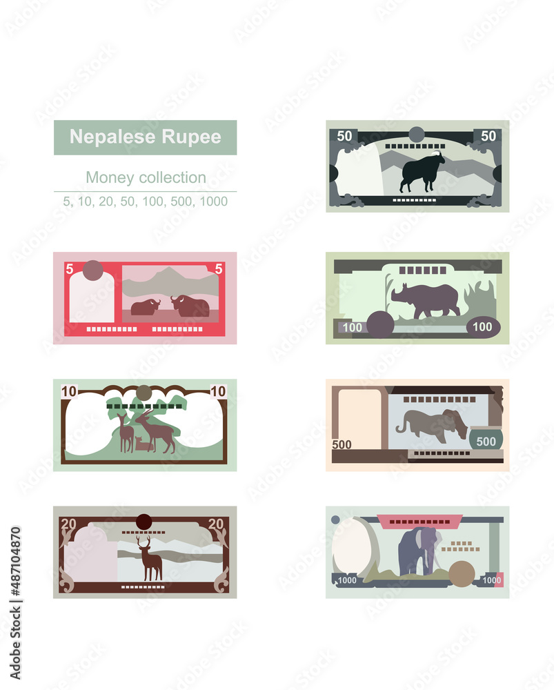

# 🇳🇵 Nepal Inflation Visualizer

A professional, beautiful, and educational tool to visualize how inflation erodes the value of money over time in Nepal.

## ✨ Features

- **Real-time Visualization**: See the size of your money shrink as inflation rises.
- **7 Denominations**: Support for all major Nepali notes (Rs. 5 to Rs. 1000).
- **Purchasing Power Context**: Compare what money could buy then vs. now (e.g., Rice, Milk, Chicken).
- **Interactive Controls**: Adjust inflation rates (0-20%) and time periods (0-50 years).
- **Beautiful & Professional Design**:
  - Dark mode interface (RGB: 0.03, 0.04, 0.06)
  - Color-coded status indicators (Green/Yellow/Red)
  - Smooth transitions and effects
- **Modular & Clean Code**: Built with Python and OpenGL for performance.

## 🚀 Getting Started

Please see [QUICK_START.md](QUICK_START.md) for detailed instructions on how to set up and run the project.

## 📚 Documentation

- [ARCHITECTURE.md](ARCHITECTURE.md) - Design patterns and code structure
- [PROJECT_STRUCTURE.md](PROJECT_STRUCTURE.md) - File organization
- [REFACTORING.md](REFACTORING.md) - Summary of recent code improvements
- [CHANGES.md](CHANGES.md) - Detailed changelog

## ⌨️ Controls

| Key | Action |
| --- | --- |
| **W / S** | Adjust Inflation Rate |
| **A / D** | Adjust Time Period |
| **1 - 7** | Select Note (5, 10, 20, 50, 100, 500, 1000) |
| **SPACE** | Toggle Auto-Play |
| **R** | Reset to Defaults |
| **ESC** | Exit Application |

## 🔧 Customization

You can easily customize colors, items, and defaults by editing `src/config.json`. See [QUICK_START.md](QUICK_START.md) for more details.

---
*Made with ❤️ for Nepal*
